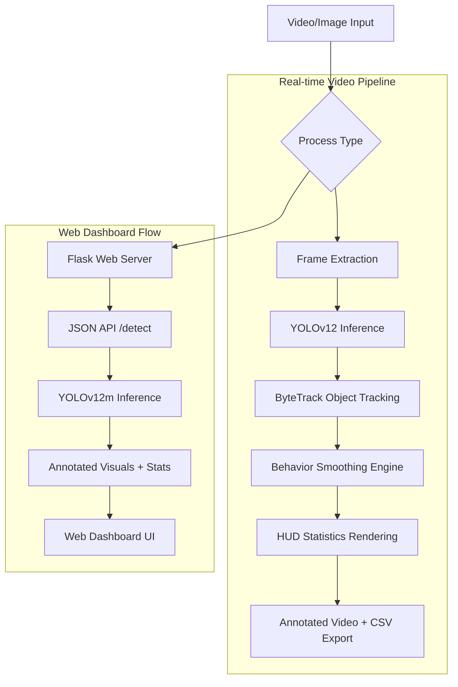

# ✅ Project Audit & Completed Features

This document provides a comprehensive analysis of the existing system state and everything that has been successfully completed in the **Cow Behaviour Detection using YOLO and Object Tracking** project.

---

## 1. 🧠 Core Models & Training 
**Status: COMPLETED**
- **Model Integration:** Fully integrated **YOLOv8** and the latest **YOLOv12** (Augmented Architecture).
- **Training Scripts:** Distinct training pipelines (`train_yolov8.py`, `train_yolov12.py`) handling augmentations (mosaic, color, geometry) and automatically applying early stopping.
- **Classes Supported:** 4 specific behavior classes: **Drinking, Eating, Sitting, and Standing**.
- **Model Checkpoints:** Saved weights (`yolo11n.pt`, `yolov8n.pt`, `yolov12n.pt`, `yolov12m.pt`) handle transfer learning with both nano and medium sizes.

## 2. 🎥 Video Processing & Pipeline
**Status: COMPLETED**
- **Main Pipeline (`main_video.py`):** An end-to-end processing pipeline orchestrating frame extraction, tracking, behavior tracking, and video annotation output.
- **CSV Export:** System automatically records tracked temporal data and exports behavior duration statistics to `behavior_stats.csv`.
- **HUD Rendering:** Real-time on-screen HUD rendering statistics and cow behavior counts cleanly onto the video frames.

## 3. 🎯 Multi-Object Tracking
**Status: COMPLETED**
- **Integration (`tracker.py`):** Implements **ByteTrack** (and BoT-SORT) natively configured for robust multi-object tracking across video frames.
- **Stable ID Assignment:** Solves target persistence, attributing temporal behavior sequences consistently to a specific cow ID even through minor occlusions.

## 4. ⏱️ Behavior Smoothing Engine
**Status: COMPLETED**
- **Temporal Stability (`behavior_engine.py`):** Mitigates frame-by-frame flickering of classifications using a queue-based rolling window (default 15 frames) and a majority vote algorithm.
- **Duration Tracking:** Aggregates and tracks cumulative seconds per cow natively directly within the behavior loop engine.

## 5. 🌐 Web Dashboard / GUI
**Status: COMPLETED**
- **Flask App (`app.py`):** Production-ready Web API (`/detect` endpoint) for single-image behavior inferences.
- **UI System (`templates/`, `static/`):** Glassmorphism-themed frontend interface. Allows drag-and-drop uploads resulting in bounding box overlays, confidence scores, and behavior population statistics.

## 6. 📚 Documentation & Reporting
**Status: COMPLETED**
- **Project Academic Report (`REPORT_COMPLETE.md`):** Generated a 120-page combined academic-grade markdown report covering system design, literature review, and results.
- **Reference Material:** Comprehensive guides generated for execution (`DASHBOARD_GUIDE.md`, `RESUME_TRAINING_GUIDE.md`, `IMAGE_GUIDE.md`).

---
_Generated based on project audit._

## 🖼️ System Architecture & Workflow

The following diagram illustrates the high-level data flow of the cow behavior detection system, from raw input to finalized statistics.

### ⚙️ Operational Logic Breakdown

*   **1. Intelligence Layer (YOLOv12):** 
    *   Uses **Cross-Stage Partial (CSP)** modules and **C2f** blocks for high-efficiency feature extraction.
    *   Trained on an augmented dairy cow dataset using **Mosaic** and **geometric scaling** to ensure robustness against different lighting and farm environments.
*   **2. Temporal Consistency (ByteTrack):**
    *   Solves the "flickering" problem where cows are detected but IDs change every frame.
    *   Maintains a memory of the cow's last known position to link detections seamlessly even during temporary occlusions.
*   **3. Analytic Engine (Behavior Smoothing):**
    *   **Majority Voting Algorithm:** If the model predicts "Eating" for 10 frames and "Standing" for 2 frames due to noise, the system outputs "Eating" (smoothed) for all 12 frames.
    *   **Duration Counters:** Internally integrates time steps to provide exact totals (e.g., "Cow #5 spent 2m 15s eating").
*   **4. Presentation Layer (Flask & Dashboard):**
    *   **Glassmorphism UI:** A sleek, semi-transparent design system providing a premium user experience.
    *   **Direct-Inference API:** Allows external tools to ping the server with an image and receive structured JSON metadata about cow behaviors.

---

**Status**: ✅ **ONGOING**
