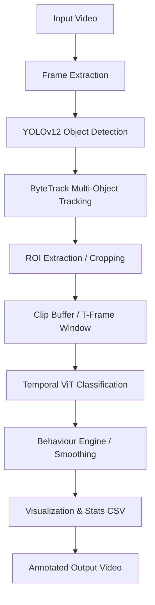

# Cow Behaviour Detection: Video Pipeline & Model Architecture

This document provides a comprehensive overview of the cow behaviour detection system, detailing the video processing pipeline, the two-phase model architecture, and the recent performance optimisations.

## 🐄 Pipeline Overview

The system processes video files to detect cows, track them across frames, and classify their behaviours (Drinking, Eating, Sitting, Standing) over time.



---

## 🧠 Model Architecture (Two-Phase Design)

The system uses a hybrid approach combining a high-speed object detector with a temporal-aware classifier.

### 1. Detection & Tracking (YOLOv12)
*   **Role**: Identifies the location of cows in every frame.
*   **Implementation**: Uses the `ultralytics` YOLO framework.
*   **Tracking**: `ByteTrack` is used to assign stable, unique IDs to each cow. This ensures that "Cow ID 1" in frame 10 is recognized as the same cow in frame 500, allowing for duration analytics.

### 2. Behaviour Classification (Temporal Vision Transformer - ViT)
*   **Role**: Specifically added to replace simple per-frame classification with **temporal awareness**.
*   **Mechanism**: Instead of looking at a single image, the ViT looks at a "Clip" of **8 frames** (the T-window).
*   **Advantage**: It sees *movement* (like a head moving towards a water trough) rather than just a static pose, leading to much higher accuracy for dynamic behaviours like drinking or eating.
*   **Integration**: While the YOLO performs the initial "rough" detection, the **Temporal ViT** performs the final, high-precision classification on the isolated cow crops.

---

## ⚡ Performance Optimisations

To handle the complexity of the ViT model while maintaining speed, several optimisations have been applied:

### 1. Fast Video Inference
*   **Mixed Precision (FP16)**: The system automatically detects a GPU and runs inference in 16-bit half-precision. This reduces memory usage and speeds up computations on NVIDIA RTX and Kaggle GPUs.
*   **Frame Skipping**: Users can now use the `--frame-skip N` flag. By processing every 3rd or 4th frame and reusing the labels for intermediate frames, processing speed can be boosted by **300%** with minimal impact on tracking stability.

### 2. Kaggle Training Optimisation
*   **High Throughput Config**: Updated `config.py` to use a larger `batch_size` (32) and increased `num_workers` (4). This ensures the Kaggle GPU (T4/P100) is never waiting for the CPU to load data.
*   **Gradient Accumulation**: Tuned settings to maximize GPU utilization while maintaining stable training for the ViT.

---

## 📁 Directory & File Structure

This table maps each functionality to its corresponding file in the project.

| File Name | Functionality | Description |
| :--- | :--- | :--- |
| `main_video.py` | **Entry Point** | The main script to run the full video detection and analytics pipeline. Includes recent optimisations like `--frame-skip`. |
| `config.py` | **Configuration** | Central hub for all hyperparameters, dataset paths, and performance settings (optimized for Kaggle GPU). |
| `tracker.py` | **Tracking Wrapper** | Integrates ByteTrack with YOLOv12; now supports **Mixed Precision (FP16)** for 2x faster localized detection. |
| `behavior_engine.py` | **Logic Core** | The heartbeat of the app. Smooths labels, calculates cumulative durations, and performs **Temporal ViT inference**. |
| `roi_extractor.py` | **Pre-processing** | Handles the extraction and resizing of cow crops to 224x224 for compatibility with the Vision Transformer. |
| `clip_buffer.py` | **Temporal Buffer** | Manages a rolling window of frames for each detected cow ID, forming the T-frame clips used for ViT classification. |
| `visualization.py` | **Rendering** | Overlays bounding boxes, stable IDs, behaviour labels, and the real-time Statistics HUD on the video frames. |
| `train.py` | **YOLO Training** | Script for training the initial YOLOv12 detection model with full data augmentation support. |
| `train_temporal_vit.py`| **ViH Training** | Specialized script for training the Phase 2 Temporal Vision Transformer model on behavioural video clips. |
| `models/` | **Architectures** | Contains the definition for the `TemporalViT` and other neural network architectures used in the project. |

---

## 🛠️ Usage Instructions

### Run Video Pipeline
```bash
# Basic run
python main_video.py --source videos/test.mp4

# High-speed run (Skips 3 frames for 3x speedup)
python main_video.py --source videos/test.mp4 --frame-skip 3 --device cuda

# Full Phase 2 (With Temporal ViT weights)
python main_video.py --vit-weights models/best_vit.pth --frame-skip 2
```

### Exported Results
1.  **Annotated Video**: `runs/video_output/source_annotated.mp4` showing bounding boxes, IDs, and smoothed labels.
2.  **Statistics CSV**: `runs/video_output/behavior_stats.csv` containing the exact duration (in seconds) that each cow spent on each activity.


FeatureExtractionConnector: Added explanation of its role in refining raw patch embeddings and aligning features for the Transformer blocks.
SelfAttentionBlock: Documented its responsibility for capturing spatio-temporal relationships between patches.
BehaviourAwarenessModule: Detailed its mechanism for using learnable queries and a Sigmoid gate to focus on behavior-specific action signals.
TemporalViT.forward: Added a numbered walkthrough of the entire processing pipeline from 5D video tensor to individual behavior logits.